# 🌐 Fennel Chainspec & Ansible Architecture

**Date**: July 19, 2025  
**Topic**: How staging chainspec works with Ansible deployment for validator setup  
**Network**: Fennel Solonet (Production)

---

## 🎯 **Overview**

This document explains the complete flow from chainspec creation to validator deployment, showing how the production chainspec is generated, distributed via GitHub releases, and used by Ansible to deploy external validators for the Fennel network.

---

## 🏗️ **Chainspec & Ansible Integration Architecture**

```mermaid
graph TB
    %% Source Code and Build Process
    subgraph "📦 Fennel Solonet Repository"
        REPO["🔧 fennel-solonet
        Source Code Repository
        Substrate/Polkadot SDK"]
        
        RUNTIME["⚙️ Fennel Runtime
        Pallets & Logic
        - ValidatorManager
        - AURA Consensus
        - GRANDPA Finality"]
        
        BUILD["🛠️ Cargo Build Process
        cargo build --release
        Rust Compilation"]
        
        BINARY["📱 fennel-node Binary
        Final Executable
        Contains Runtime"]
    end
    
    %% Chainspec Generation
    subgraph "🌐 Chainspec Generation"
        RAW_SPEC["📄 Raw Chainspec Generator
        fennel-node build-spec
        --chain production --raw"]
        
        PRODUCTION_RAW["📋 production-raw.json
        Complete Network Config
        - Genesis state
        - Runtime code
        - Initial validators
        - Bootnode addresses"]
        
        SPEC_RELEASE["📂 GitHub Release
        production-raw.json
        Public distribution"]
    end
    
    %% GitHub Release Distribution
    subgraph "� GitHub Release Distribution"
        RELEASE_CREATE["� GitHub Release
        Auto-generated on CI/CD
        Version tags"]
        
        BINARY_RELEASE["� Binary Release
        fennel-node-linux-x86_64
        With checksum verification"]
        
        CHAINSPEC_RELEASE["� Chainspec Release
        production-raw.json
        Network configuration"]
        
        RELEASE_ASSETS["� Release Assets
        - Binary + checksum
        - Chainspec JSON
        - Version metadata"]
    end
    
    %% External Validator Setup
    subgraph "☁️ External Validator (Cloud Provider)"
        ANSIBLE_BOOTSTRAP["🔧 fennel-bootstrap.sh
        Ansible Bootstrap Script
        Primary deployment method"]
        
        BINARY_DOWNLOAD["� Binary Download
        Direct GitHub release download
        Checksum verification"]
        
        CHAINSPEC_DL["📥 Chainspec Download
        curl production-raw.json
        Network Configuration"]
        
        ANSIBLE_DEPLOY["🏗️ Ansible Deployment
        Parity Technologies collection
        Enterprise-grade automation"]
    end
    
    %% Ansible Configuration
    subgraph "⚙️ Ansible Configuration"
        PARITY_COLLECTION["📚 Parity Collection
        paritytech.chain
        Official Substrate roles"]
        
        NODE_ROLE["🔗 node Role
        Binary deployment
        Systemd service creation"]
        
        KEY_INJECT["🔑 key_inject Role
        Temporary key injection
        Startup configuration"]
        
        SYSTEMD_SERVICE["🔧 Systemd Service
        fennel-node.service
        Native process management"]
    end
    
    %% Validator Launch Process
    subgraph "🚀 Validator Launch"
        SERVICE_START["▶️ Service Startup
        systemctl start fennel-node
        Native system service"]
        
        CHAIN_SYNC["🔄 Chain Synchronization
        Connect to bootnodes
        Download blockchain state"]
        
        KEY_ROTATION["🔄 Key Rotation
        author_rotateKeys RPC
        Production key generation"]
        
        CONSENSUS_JOIN["⚖️ Consensus Participation
        AURA + GRANDPA
        Block production/finalization"]
    end
    
    %% Network Infrastructure
    subgraph "🌍 Fennel Network Infrastructure"
        BOOTNODES["🌐 Bootnodes
        bootnode1.fennel.network
        bootnode2.fennel.network"]
        
        EXISTING_VALS["🔷 Existing Validators
        Internal network validators
        Consensus participants"]
        
        NETWORK_STATE["⛓️ Network State
        Shared blockchain
        Distributed consensus"]
    end
    
    %% Flow connections
    REPO --> RUNTIME
    RUNTIME --> BUILD
    BUILD --> BINARY
    BINARY --> RAW_SPEC
    RAW_SPEC --> PRODUCTION_RAW
    PRODUCTION_RAW --> SPEC_RELEASE
    
    %% Release flow
    REPO --> RELEASE_CREATE
    BINARY --> BINARY_RELEASE
    PRODUCTION_RAW --> CHAINSPEC_RELEASE
    BINARY_RELEASE --> RELEASE_ASSETS
    CHAINSPEC_RELEASE --> RELEASE_ASSETS
    
    %% External validator flow
    ANSIBLE_BOOTSTRAP --> BINARY_DOWNLOAD
    BINARY_RELEASE --> BINARY_DOWNLOAD
    SPEC_RELEASE --> CHAINSPEC_DL
    BINARY_DOWNLOAD --> ANSIBLE_DEPLOY
    CHAINSPEC_DL --> ANSIBLE_DEPLOY
    
    %% Ansible deployment
    ANSIBLE_DEPLOY --> PARITY_COLLECTION
    PARITY_COLLECTION --> NODE_ROLE
    PARITY_COLLECTION --> KEY_INJECT
    NODE_ROLE --> SYSTEMD_SERVICE
    KEY_INJECT --> SYSTEMD_SERVICE
    
    %% Validator startup
    SYSTEMD_SERVICE --> SERVICE_START
    SERVICE_START --> CHAIN_SYNC
    BOOTNODES --> CHAIN_SYNC
    CHAIN_SYNC --> KEY_ROTATION
    KEY_ROTATION --> CONSENSUS_JOIN
    CONSENSUS_JOIN --> NETWORK_STATE
    EXISTING_VALS --> NETWORK_STATE
    
    %% Styling
    classDef source fill:#e1f5fe,stroke:#01579b,stroke-width:2px
    classDef chainspec fill:#f3e5f5,stroke:#4a148c,stroke-width:2px
    classDef release fill:#e8f5e8,stroke:#2e7d32,stroke-width:2px
    classDef external fill:#fff3e0,stroke:#e65100,stroke-width:2px
    classDef ansible fill:#f3e5f5,stroke:#4a148c,stroke-width:2px
    classDef network fill:#fce4ec,stroke:#880e4f,stroke-width:2px
    
    class REPO,RUNTIME,BUILD,BINARY source
    class RAW_SPEC,PRODUCTION_RAW,SPEC_RELEASE chainspec
    class RELEASE_CREATE,BINARY_RELEASE,CHAINSPEC_RELEASE,RELEASE_ASSETS release
    class ANSIBLE_BOOTSTRAP,BINARY_DOWNLOAD,CHAINSPEC_DL,ANSIBLE_DEPLOY external
    class PARITY_COLLECTION,NODE_ROLE,KEY_INJECT,SYSTEMD_SERVICE,SERVICE_START,CHAIN_SYNC,KEY_ROTATION,CONSENSUS_JOIN ansible
    class BOOTNODES,EXISTING_VALS,NETWORK_STATE network
```



---

## 🔄 **Detailed Process Flow**

```mermaid
sequenceDiagram
    participant DEV as 👩‍💻 Developer
    participant REPO as 📦 fennel-solonet
    participant BUILD as 🛠️ Build System
    participant RELEASE as � GitHub Release
    participant OPERATOR as 🧑‍💻 Validator Operator
    participant ANSIBLE as 🔧 Ansible Engine
    participant VALIDATOR as 🔷 External Validator
    participant NETWORK as 🌐 Fennel Network

    Note over DEV,NETWORK: Phase 1: Development & Build
    DEV->>REPO: Commit runtime changes
    REPO->>BUILD: Trigger CI/CD pipeline
    BUILD->>BUILD: cargo build --release
    BUILD->>BUILD: Generate production chainspec
    Note right of BUILD: fennel-node build-spec<br/>--chain production --raw
    
    Note over DEV,NETWORK: Phase 2: GitHub Release Creation
    BUILD->>RELEASE: Create GitHub release
    BUILD->>RELEASE: Upload binary + checksum
    BUILD->>RELEASE: Upload production-raw.json
    Note right of RELEASE: Release assets:<br/>- fennel-node-linux-x86_64<br/>- production-raw.json<br/>- SHA256 checksums
    
    Note over DEV,NETWORK: Phase 3: External Validator Setup
    OPERATOR->>VALIDATOR: Run ./fennel-bootstrap.sh <IP>
    VALIDATOR->>RELEASE: Download fennel-node binary
    VALIDATOR->>VALIDATOR: Verify binary checksum
    VALIDATOR->>RELEASE: Download production chainspec
    Note right of VALIDATOR: Direct downloads:<br/>- Binary from releases<br/>- Chainspec JSON<br/>- Checksum verification
    
    Note over DEV,NETWORK: Phase 4: Ansible Deployment
    VALIDATOR->>ANSIBLE: Execute Ansible playbook
    ANSIBLE->>ANSIBLE: Load Parity collection
    Note right of ANSIBLE: paritytech.chain collection:<br/>- node role<br/>- key_inject role
    
    ANSIBLE->>VALIDATOR: Create fennel user
    ANSIBLE->>VALIDATOR: Install binary to /usr/local/bin
    ANSIBLE->>VALIDATOR: Create systemd service
    ANSIBLE->>VALIDATOR: Configure chainspec path
    ANSIBLE->>VALIDATOR: Inject temporary startup keys
    
    Note over DEV,NETWORK: Phase 5: Service Launch
    ANSIBLE->>VALIDATOR: systemctl start fennel-node
    VALIDATOR->>VALIDATOR: Start with production chainspec
    Note right of VALIDATOR: Native systemd service:<br/>--chain production-raw.json<br/>--validator --name "validator"
    
    VALIDATOR->>NETWORK: Connect to bootnodes
    NETWORK->>VALIDATOR: Peer discovery
    NETWORK->>VALIDATOR: Blockchain sync
    Note right of NETWORK: Download complete<br/>blockchain state
    
    Note over DEV,NETWORK: Phase 6: Production Key Generation
    ANSIBLE->>VALIDATOR: Call author_rotateKeys RPC
    VALIDATOR->>VALIDATOR: Generate production session keys
    VALIDATOR->>ANSIBLE: Return secure session keys
    ANSIBLE->>OPERATOR: Display keys for registration
    Note right of OPERATOR: SECURE: Real production keys<br/>generated locally on validator
    
    Note over DEV,NETWORK: Phase 7: Consensus Participation
    OPERATOR->>NETWORK: Register validator with session keys
    VALIDATOR->>NETWORK: Join AURA consensus
    VALIDATOR->>NETWORK: Join GRANDPA finality
    NETWORK->>VALIDATOR: Session rotation
    Note right of NETWORK: Validator active in<br/>consensus rotation
```



---

## 📋 **Key Components Explained**

### **1. Production Chainspec Generation**
```bash
# Command used to generate production chainspec
fennel-node build-spec --chain production --raw > production-raw.json

# What it contains:
{
  "name": "Fennel Production",
  "id": "fennel_production",
  "chainType": "Live",
  "bootNodes": [
    "/dns4/bootnode1.fennel.network/tcp/30333/p2p/12D3KooWS84f71...",
    "/dns4/bootnode2.fennel.network/tcp/30333/p2p/12D3KooWLWzcGV..."
  ],
  "genesis": {
    "runtime": "0x<compiled_wasm_runtime>",
    "raw": {
      "top": {
        // Initial state data
        // Validator set
        // Account balances
        // Pallet configurations
      }
    }
  }
}
```

### **2. Ansible Playbook Structure**
```yaml
# ansible/validator.yml - Main deployment playbook
---
- hosts: fennel_validators
  become: yes
  collections:
    - paritytech.chain          # Official Parity collection
  
  vars:
    node_app_name: fennel-node
    node_binary_version: v0.5.9
    node_chain: /home/fennel/chainspecs/production-raw.json
    node_binary: https://github.com/.../fennel-node-linux-x86_64
    node_binary_checksum: "sha256:93c2651c55a5fd..."
    node_role: validator
    
  roles:
    - paritytech.chain.node         # Deploy binary and systemd service
    - paritytech.chain.key_inject   # Inject temporary startup keys
```

### **3. Validator Startup Command**
```bash
# Final systemd service command
/usr/local/bin/fennel-node \
  --chain "/home/fennel/chainspecs/production-raw.json" \
  --validator \
  --name "fennel-validator" \
  --base-path "/var/lib/fennel" \
  --port 30333 \
  --rpc-port 9944 \
  --prometheus-port 9615 \
  --bootnodes="/dns4/bootnode1.fennel.network/tcp/30333/p2p/12D3KooWS84f71..." \
  --bootnodes="/dns4/bootnode2.fennel.network/tcp/30333/p2p/12D3KooWLWzcGV..." \
  --rpc-cors all \
  --rpc-methods safe \
  --log info
```

---

## 🔗 **Data Flow Summary**

### **Chainspec Flow**
1. **Source**: Runtime code in `fennel-solonet` repository
2. **Generation**: `fennel-node build-spec --chain production --raw`
3. **Distribution**: Released as GitHub release asset `production-raw.json`
4. **Download**: Ansible downloads via HTTPS during deployment
5. **Usage**: Loaded by systemd service at startup for network config

### **Binary Distribution Flow**
1. **Build**: CI/CD compiles Rust code into `fennel-node` binary
2. **Release**: GitHub release with binary and SHA256 checksum
3. **Download**: Ansible downloads and verifies checksum
4. **Installation**: Binary installed to `/usr/local/bin/fennel-node`
5. **Execution**: Systemd service runs binary with production chainspec

### **Ansible Deployment Flow**
1. **Bootstrap**: `fennel-bootstrap.sh` triggers Ansible playbook
2. **Collection**: Parity Technologies `paritytech.chain` collection
3. **Roles**: `node` role (binary + systemd) + `key_inject` role (startup keys)
4. **Service**: Native systemd service management
5. **Keys**: Production keys generated via `author_rotateKeys` RPC

### **Network Integration**
1. **Bootstrap**: Validator connects to bootnodes from chainspec
2. **Sync**: Downloads complete blockchain state from network
3. **Keys**: Local generation of production session keys for security
4. **Consensus**: Participates in AURA block production and GRANDPA finality
5. **Identity**: Uses generated network identity for P2P communication

---

## 🎯 **Why This Architecture Works**

### **🔒 Security Benefits**
- **Checksum Verification**: SHA256 checksums ensure binary integrity
- **Verifiable Chainspec**: JSON format allows validation and auditing
- **Native Execution**: No container runtime attack surface
- **Local Key Generation**: Production keys generated securely on validator
- **Network Verification**: Chainspec contains trusted bootnode addresses

### **⚖️ Consistency Benefits**
- **Same Runtime**: All validators use identical runtime code
- **Same Genesis**: Shared initial state across network
- **Same Configuration**: Consistent network parameters via chainspec
- **Version Control**: GitHub releases prevent version drift
- **Standard Deployment**: Parity Technologies collection ensures consistency

### **🚀 Operational Benefits**
- **Enterprise-Grade**: Parity Technologies' battle-tested Ansible roles
- **Automated Deployment**: One-command validator setup
- **Native Performance**: Direct systemd service (no container overhead)
- **Professional Operations**: Standard systemctl commands for management
- **Secure Key Management**: Production keys never stored in configuration

---

## 🔍 **Troubleshooting Reference**

### **Common Issues**
1. **Binary Download**: GitHub API rate limits or network timeouts
2. **Checksum Verification**: Binary corruption during download
3. **Ansible Dependencies**: Missing Parity collection or Ansible version
4. **Service Startup**: Chainspec path or permissions issues
5. **Network Connectivity**: Bootnode connection problems

### **Verification Commands**
```bash
# Verify binary installation
/usr/local/bin/fennel-node --version

# Check systemd service status
systemctl status fennel-node

# Verify chainspec is valid JSON
jq . /home/fennel/chainspecs/production-raw.json

# Check Ansible collection
ansible-galaxy collection list paritytech.chain

# Test network connectivity
curl -I https://bootnode1.fennel.network:30333

# Check validator logs
journalctl -u fennel-node -f

# Verify production keys were generated
curl -X POST -H "Content-Type: application/json" \
  -d '{"jsonrpc":"2.0","method":"author_hasSessionKeys","params":["0x..."],"id":1}' \
  http://localhost:9944
```

### **Key Management**
```bash
# Generate new session keys (run on validator)
curl -X POST -H "Content-Type: application/json" \
  -d '{"jsonrpc":"2.0","method":"author_rotateKeys","params":[],"id":1}' \
  http://localhost:9944

# Verify keys are loaded
curl -X POST -H "Content-Type: application/json" \
  -d '{"jsonrpc":"2.0","method":"author_hasKey","params":["0x...","aura"],"id":1}' \
  http://localhost:9944
```

---

**🌱 This architecture enables reliable, consistent, and secure deployment of external validators for the Fennel network using enterprise-grade Ansible automation! 🚀**
