# 🌐 Fennel Chainspec & Docker Architecture

**Date**: July 8, 2025  
**Topic**: How staging chainspec works with Docker image for validator deployment  
**Network**: Fennel Solonet (Staging)

---

## 🎯 **Overview**

This document explains the complete flow from chainspec creation to validator deployment, showing how the staging chainspec is generated, packaged in Docker images, and used to launch external validators for the Fennel network.

---

## 🏗️ **Chainspec & Docker Integration Architecture**

```mermaid
graph TB
    %% Source Code and Build Process
    subgraph "📦 Fennel Solonet Repository"
        REPO["🔧 fennel-solonet
        Source Code Repository
        Substrate/Polkadot SDK"]
        
        RUNTIME["⚙️ Fennel Runtime
        Pallets & Logic
        - ValidatorManager
        - AURA Consensus
        - GRANDPA Finality"]
        
        BUILD["🛠️ Cargo Build Process
        cargo build --release
        Rust Compilation"]
        
        BINARY["📱 fennel-node Binary
        Final Executable
        Contains Runtime"]
    end
    
    %% Chainspec Generation
    subgraph "🌐 Chainspec Generation"
        RAW_SPEC["📄 Raw Chainspec Generator
        fennel-node build-spec
        --chain staging --raw"]
        
        STAGING_RAW["📋 staging-raw.json
        Complete Network Config
        - Genesis state
        - Runtime code
        - Initial validators
        - Bootnode addresses"]
        
        SPEC_REPO["📂 Chainspec Storage
        /chainspecs/staging/
        staging-raw.json"]
    end
    
    %% Docker Image Building
    subgraph "🐳 Docker Image Creation"
        DOCKERFILE["📝 Dockerfile
        Multi-stage build
        - Rust environment
        - Binary compilation
        - Runtime packaging"]
        
        DOCKER_BUILD["🔨 Docker Build Process
        docker build -t fennel-solonet
        Automated CI/CD"]
        
        DOCKER_IMAGE["📦 Docker Image
        ghcr.io/corruptedaesthetic/
        fennel-solonet:sha-3fb1b156"]
        
        IMAGE_CONTENT["📦 Image Contents
        - fennel-node binary
        - Runtime WASM
        - Base Ubuntu/Alpine
        - Dependencies"]
    end
    
    %% External Validator Setup
    subgraph "☁️ External Validator (Oracle Cloud)"
        INSTALL_SCRIPT["🔧 install.sh
        Validator Setup Script
        Primary: Docker extraction"]
        
        DOCKER_EXTRACT["🐳 Docker Extraction
        docker cp container:/binary
        Extract fennel-node"]
        
        CHAINSPEC_DL["📥 Chainspec Download
        curl staging-raw.json
        Network Configuration"]
        
        LOCAL_FILES["📁 Local Validator Files
        - bin/fennel-node
        - config/staging-chainspec.json
        - data/ (validator state)"]
    end
    
    %% Validator Launch Process
    subgraph "🚀 Validator Launch"
        VALIDATOR_START["▶️ Validator Startup
        ./validate.sh start
        Launch Process"]
        
        CHAIN_SYNC["🔄 Chain Synchronization
        Connect to bootnodes
        Download blockchain state"]
        
        CONSENSUS_JOIN["⚖️ Consensus Participation
        AURA + GRANDPA
        Block production/finalization"]
    end
    
    %% Network Infrastructure
    subgraph "🌍 Fennel Network Infrastructure"
        BOOTNODES["🌐 Bootnodes
        bootnode1.fennel.network
        bootnode2.fennel.network"]
        
        EXISTING_VALS["🔷 Existing Validators
        Internal network validators
        Consensus participants"]
        
        NETWORK_STATE["⛓️ Network State
        Shared blockchain
        Distributed consensus"]
    end
    
    %% Flow connections
    REPO --> RUNTIME
    RUNTIME --> BUILD
    BUILD --> BINARY
    BINARY --> RAW_SPEC
    RAW_SPEC --> STAGING_RAW
    STAGING_RAW --> SPEC_REPO
    
    %% Docker build flow
    REPO --> DOCKERFILE
    BINARY --> DOCKERFILE
    DOCKERFILE --> DOCKER_BUILD
    DOCKER_BUILD --> DOCKER_IMAGE
    BINARY --> IMAGE_CONTENT
    DOCKER_IMAGE --> IMAGE_CONTENT
    
    %% External validator flow
    INSTALL_SCRIPT --> DOCKER_EXTRACT
    DOCKER_IMAGE --> DOCKER_EXTRACT
    SPEC_REPO --> CHAINSPEC_DL
    DOCKER_EXTRACT --> LOCAL_FILES
    CHAINSPEC_DL --> LOCAL_FILES
    
    %% Validator startup
    LOCAL_FILES --> VALIDATOR_START
    VALIDATOR_START --> CHAIN_SYNC
    BOOTNODES --> CHAIN_SYNC
    CHAIN_SYNC --> CONSENSUS_JOIN
    CONSENSUS_JOIN --> NETWORK_STATE
    EXISTING_VALS --> NETWORK_STATE
    
    %% Styling
    classDef source fill:#e1f5fe,stroke:#01579b,stroke-width:2px
    classDef chainspec fill:#f3e5f5,stroke:#4a148c,stroke-width:2px
    classDef docker fill:#e8f5e8,stroke:#2e7d32,stroke-width:2px
    classDef external fill:#fff3e0,stroke:#e65100,stroke-width:2px
    classDef network fill:#fce4ec,stroke:#880e4f,stroke-width:2px
    
    class REPO,RUNTIME,BUILD,BINARY source
    class RAW_SPEC,STAGING_RAW,SPEC_REPO chainspec
    class DOCKERFILE,DOCKER_BUILD,DOCKER_IMAGE,IMAGE_CONTENT docker
    class INSTALL_SCRIPT,DOCKER_EXTRACT,CHAINSPEC_DL,LOCAL_FILES,VALIDATOR_START,CHAIN_SYNC,CONSENSUS_JOIN external
    class BOOTNODES,EXISTING_VALS,NETWORK_STATE network
```



---

## 🔄 **Detailed Process Flow**

```mermaid
sequenceDiagram
    participant DEV as 👩‍💻 Developer
    participant REPO as 📦 fennel-solonet
    participant BUILD as 🛠️ Build System
    participant REGISTRY as 🐳 Container Registry
    participant OPERATOR as 🧑‍💻 Validator Operator
    participant VALIDATOR as 🔷 External Validator
    participant NETWORK as 🌐 Fennel Network

    Note over DEV,NETWORK: Phase 1: Development & Build
    DEV->>REPO: Commit runtime changes
    REPO->>BUILD: Trigger CI/CD pipeline
    BUILD->>BUILD: cargo build --release
    BUILD->>BUILD: Generate staging chainspec
    Note right of BUILD: fennel-node build-spec<br/>--chain staging --raw
    
    Note over DEV,NETWORK: Phase 2: Docker Image Creation
    BUILD->>BUILD: Create Docker image
    Note right of BUILD: Multi-stage Dockerfile:<br/>1. Rust build environment<br/>2. Binary compilation<br/>3. Runtime packaging
    BUILD->>REGISTRY: Push Docker image
    Note right of REGISTRY: ghcr.io/corruptedaesthetic/<br/>fennel-solonet:sha-3fb1b156
    
    Note over DEV,NETWORK: Phase 3: Chainspec Distribution
    BUILD->>REPO: Store staging-raw.json
    Note right of REPO: /chainspecs/staging/<br/>staging-raw.json<br/>(3.7MB network config)
    
    Note over DEV,NETWORK: Phase 4: External Validator Setup
    OPERATOR->>VALIDATOR: Run ./install.sh
    VALIDATOR->>REGISTRY: docker pull fennel-solonet
    VALIDATOR->>VALIDATOR: Extract binary from container
    Note right of VALIDATOR: docker cp container:/binary<br/>Handle directory extraction<br/>Verify binary works
    
    VALIDATOR->>REPO: Download staging chainspec
    Note right of VALIDATOR: curl staging-raw.json<br/>Validate JSON format<br/>Store locally
    
    Note over DEV,NETWORK: Phase 5: Validator Configuration
    OPERATOR->>VALIDATOR: ./setup-validator.sh
    VALIDATOR->>VALIDATOR: Configure validator settings
    OPERATOR->>VALIDATOR: ./validate.sh init
    VALIDATOR->>VALIDATOR: Generate network identity
    
    Note over DEV,NETWORK: Phase 6: Network Connection
    OPERATOR->>VALIDATOR: ./validate.sh start
    VALIDATOR->>VALIDATOR: Start with staging chainspec
    Note right of VALIDATOR: --chain config/staging-chainspec.json<br/>--validator --name "fastcat"
    
    VALIDATOR->>NETWORK: Connect to bootnodes
    NETWORK->>VALIDATOR: Peer discovery
    NETWORK->>VALIDATOR: Blockchain sync
    Note right of NETWORK: Download complete<br/>blockchain state
    
    Note over DEV,NETWORK: Phase 7: Consensus Participation
    VALIDATOR->>NETWORK: Join AURA consensus
    VALIDATOR->>NETWORK: Join GRANDPA finality
    NETWORK->>VALIDATOR: Session rotation
    Note right of NETWORK: Validator active in<br/>consensus every 50 blocks
```



---

## 📋 **Key Components Explained**

### **1. Staging Chainspec Generation**
```bash
# Command used to generate staging chainspec
fennel-node build-spec --chain staging --raw > staging-raw.json

# What it contains:
{
  "name": "Fennel Staging",
  "id": "fennel_staging",
  "chainType": "Development",
  "bootNodes": [
    "/dns4/bootnode1.fennel.network/tcp/30333/p2p/12D3KooWS84f71...",
    "/dns4/bootnode2.fennel.network/tcp/30333/p2p/12D3KooWLWzcGV..."
  ],
  "genesis": {
    "runtime": "0x<compiled_wasm_runtime>",
    "raw": {
      "top": {
        // Initial state data
        // Validator set
        // Account balances
        // Pallet configurations
      }
    }
  }
}
```

### **2. Docker Image Structure**
```dockerfile
# Simplified Dockerfile structure
FROM rust:1.70 as builder
WORKDIR /app
COPY . .
RUN cargo build --release

FROM ubuntu:20.04
COPY --from=builder /app/target/release/fennel-node /usr/local/bin/
EXPOSE 30333 9944 9615
ENTRYPOINT ["fennel-node"]
```

### **3. Validator Startup Command**
```bash
# Final command that launches validator
./bin/fennel-node \
  --chain "config/staging-chainspec.json" \
  --validator \
  --name "fastcat" \
  --base-path "./data" \
  --port 30333 \
  --rpc-port 9944 \
  --prometheus-port 9615 \
  --bootnodes="/dns4/bootnode1.fennel.network/tcp/30333/p2p/12D3KooWS84f71..." \
  --bootnodes="/dns4/bootnode2.fennel.network/tcp/30333/p2p/12D3KooWLWzcGV..." \
  --rpc-cors all \
  --rpc-methods safe \
  --log info
```

---

## 🔗 **Data Flow Summary**

### **Chainspec Flow**
1. **Source**: Runtime code in `fennel-solonet` repository
2. **Generation**: `fennel-node build-spec --chain staging --raw`
3. **Storage**: Committed to `/chainspecs/staging/staging-raw.json`
4. **Distribution**: Downloaded via HTTPS during validator setup
5. **Usage**: Loaded by validator at startup for network config

### **Docker Image Flow**
1. **Build**: CI/CD compiles Rust code into `fennel-node` binary
2. **Package**: Dockerfile creates container with binary and dependencies
3. **Registry**: Pushed to GitHub Container Registry with specific SHA
4. **Distribution**: External validators pull and extract binary
5. **Execution**: Binary runs with downloaded chainspec

### **Network Integration**
1. **Bootstrap**: Validator connects to bootnodes from chainspec
2. **Sync**: Downloads complete blockchain state from network
3. **Consensus**: Participates in AURA block production and GRANDPA finality
4. **Identity**: Uses generated network identity for P2P communication

---

## 🎯 **Why This Architecture Works**

### **🔒 Security Benefits**
- **Immutable Images**: Docker SHA ensures binary consistency
- **Verifiable Chainspec**: JSON format allows validation
- **Isolated Extraction**: Binary extracted safely from container
- **Network Verification**: Chainspec contains trusted bootnode addresses

### **⚖️ Consistency Benefits**
- **Same Runtime**: All validators use identical runtime code
- **Same Genesis**: Shared initial state across network
- **Same Configuration**: Consistent network parameters
- **Version Control**: Specific SHA prevents version drift

### **🚀 Operational Benefits**
- **Automated Builds**: CI/CD ensures fresh images
- **Easy Distribution**: Docker registry handles image distribution
- **Simple Setup**: One-command validator deployment
- **Fallback Options**: Release downloads if Docker unavailable

---

## 🔍 **Troubleshooting Reference**

### **Common Issues**
1. **Binary Extraction**: Directory vs file extraction handling
2. **Chainspec Download**: Large file (3.7MB) timeout issues
3. **Docker Availability**: Fallback to release downloads
4. **Network Connectivity**: Bootnode connection problems

### **Verification Commands**
```bash
# Verify binary works
./bin/fennel-node --version

# Verify chainspec is valid JSON
jq . config/staging-chainspec.json

# Check Docker image
docker inspect ghcr.io/corruptedaesthetic/fennel-solonet:sha-3fb1b156

# Test network connectivity
curl -I https://bootnode1.fennel.network:30333
```

---

**🌱 This architecture enables reliable, consistent, and secure deployment of external validators for the Fennel network! 🚀**
