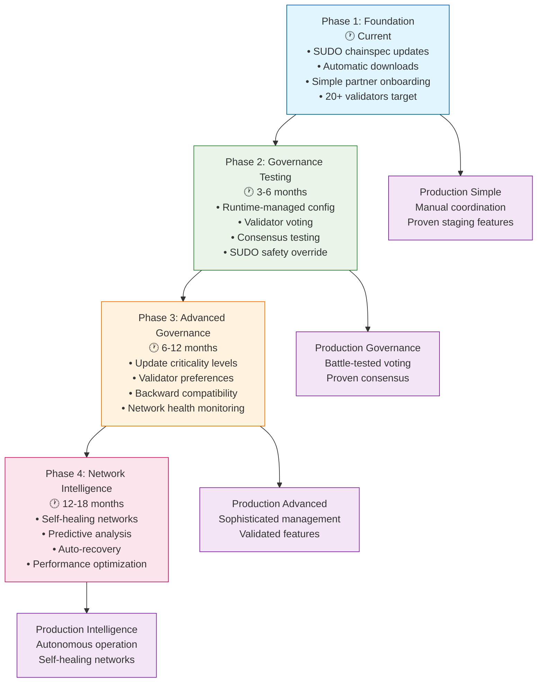

# Staging Environment Governance Roadmap

**Progressive evolution from centralized to decentralized network management**

## 🎯 **Strategic Vision**

Use the **staging environment** as a **governance laboratory** to test, refine, and prove advanced network management before production deployment.



## 📈 **Progressive Phases**

### **Phase 1: Foundation (Current)**
**Timeline:** Immediate - Partners onboarding now  
**Goal:** Establish basic validator operations

**Network Management:**
- ✅ SUDO-controlled chainspec updates
- ✅ Automatic download and application  
- ✅ No validator coordination required

**Current Workflow:**
```bash
# Organization updates chainspec in fennel-solonet
git push origin main  # Updates staging-chainspec.json

# All validators automatically get updates  
./validate.sh start  # Auto-downloads latest chainspec
```

**Benefits:**
- Simple partner onboarding
- Rapid iteration capability
- Learning-focused environment
- Network stability through central control

---

### **Phase 2: Governance Testing (3-6 months)**
**Timeline:** After 20+ active staging validators  
**Goal:** Test decentralized governance mechanisms

**Network Management Evolution:**
- 🔄 Introduce runtime-managed configuration
- 🗳️ Add validator voting mechanisms
- 📊 Test consensus thresholds  
- 🛡️ Maintain SUDO as safety override

**New Governance Workflow:**
```bash
# 1. Organization proposes update
sudo.sudo(
    network_governance.propose_bootnode_update(
        new_bootnodes,
        voting_period: 7200,     # 24 hours
        approval_threshold: 51   # 51% validator approval
    )
)

# 2. Validators automatically vote via nodes
# 3. After threshold: automatic application
```

**Testing Scenarios:**
- Consensus thresholds (51%, 67%, 80%)
- Voting periods (6hr, 24hr, 48hr)
- Update types (critical vs optional)
- Safety mechanisms (rollback, override)

---

### **Phase 3: Advanced Governance (6-12 months)**  
**Timeline:** After governance testing proves stable
**Goal:** Sophisticated decentralized network management

**Update Criticality System:**
```rust
pub enum UpdateCriticality {
    Critical,    // 90% consensus + 48hr delay
    Important,   // 67% consensus + 24hr delay
    Standard,    // 51% consensus + 12hr delay  
    Optional,    // Individual validator choice
}
```

**Validator Preferences:**
```rust
pub struct ValidatorGovernancePrefs {
    pub auto_adopt_optional: bool,
    pub minimum_criticality: UpdateCriticality,
    pub max_delay_tolerance: BlockNumber,
}
```

**Advanced Features:**
- Graduated consensus levels by criticality
- Validator choice for non-critical updates
- Backward compatibility management
- Network health monitoring

---

### **Phase 4: Network Intelligence (12-18 months)**
**Timeline:** After advanced governance is battle-tested
**Goal:** Self-healing, intelligent network management

**Self-Healing Capabilities:**
- 🧠 Automatic compatibility assessment
- 🔄 Network fragment detection and recovery
- 📊 Performance-based recommendations
- 🛡️ Predictive failure prevention

**Intelligent Features:**
```bash
# System detects issues automatically
network_intelligence.analyze_performance()
# "Network latency increased 15% - bootnode optimization recommended"

# Proposes solutions with risk assessment
network_intelligence.propose_optimization(
    issue: LatencyIncrease,
    solution: BootnodeRebalancing,
    risk_level: Low,
    estimated_improvement: "15% latency reduction"
)
```

## 🛡️ **Network Protection Evolution**

### **Phase 2 Protections**
- ✅ SUDO override capability
- ✅ Automatic rollback on failure
- ✅ Staged rollout testing

### **Phase 3 Protections**
- ✅ Compatibility layers for multiple versions
- ✅ Gradual adoption for non-critical updates
- ✅ Continuous health monitoring

### **Phase 4 Protections**
- ✅ Predictive issue prevention
- ✅ Automatic network healing
- ✅ Performance optimization

## 📊 **Success Metrics by Phase**

### **Phase 1 (Current)**
- [ ] 20+ active staging validators
- [ ] 99%+ validator uptime
- [ ] Zero coordination failures
- [ ] High partner satisfaction

### **Phase 2 (Governance Testing)**
- [ ] 100+ successful governance votes
- [ ] Zero network splits from updates
- [ ] <5 minute update propagation
- [ ] 90%+ validator voting participation

### **Phase 3 (Advanced Governance)**
- [ ] 5+ update criticality levels supported
- [ ] 99%+ backward compatibility success
- [ ] Zero forced validator upgrades
- [ ] 30+ days autonomous operation

### **Phase 4 (Network Intelligence)**
- [ ] 90%+ automatic issue detection
- [ ] <1 minute fragment recovery
- [ ] 20%+ performance improvements
- [ ] Zero manual interventions needed

## 🚀 **Implementation Benefits**

### **For Partners**
- ✅ Gradual learning curve from simple to sophisticated
- ✅ Production readiness through staging experience
- ✅ No surprises in production deployment
- ✅ Skills development in network governance

### **For Network**
- ✅ Battle-tested features before production
- ✅ Proven governance mechanisms
- ✅ Industry-leading network management
- ✅ Minimized production risks

### **For Organization**
- ✅ Network governance expertise
- ✅ Partner confidence demonstration
- ✅ Competitive advantage in blockchain infrastructure
- ✅ Smooth production transitions

## 📅 **Phase Transition Criteria**

### **Phase 1 → 2 Requirements**
- ✅ 20+ stable staging validators (30+ days)
- ✅ Partners comfortable with basic operations
- ✅ Governance pallet tested in development
- ✅ Safety mechanisms proven

### **Phase 2 → 3 Requirements**
- ✅ 100+ successful governance votes
- ✅ Zero network failures from governance
- ✅ High validator participation rates
- ✅ Advanced features tested

### **Phase 3 → 4 Requirements**
- ✅ Complex governance scenarios handled
- ✅ Multi-version compatibility proven
- ✅ Network intelligence components ready
- ✅ Self-healing mechanisms tested

## 🎯 **Strategic Outcome**

This roadmap transforms the staging environment from a simple testing ground into a **governance innovation laboratory** that:

1. **Proves concepts** before production deployment
2. **Trains partners** in advanced network management
3. **Develops expertise** in decentralized governance
4. **Minimizes risks** through progressive testing
5. **Establishes leadership** in blockchain network management

**The staging network becomes the proving ground for the future of decentralized network governance!** 🚀 