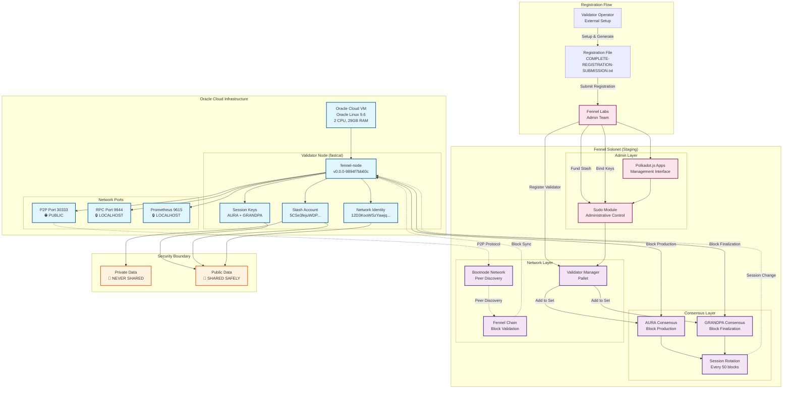
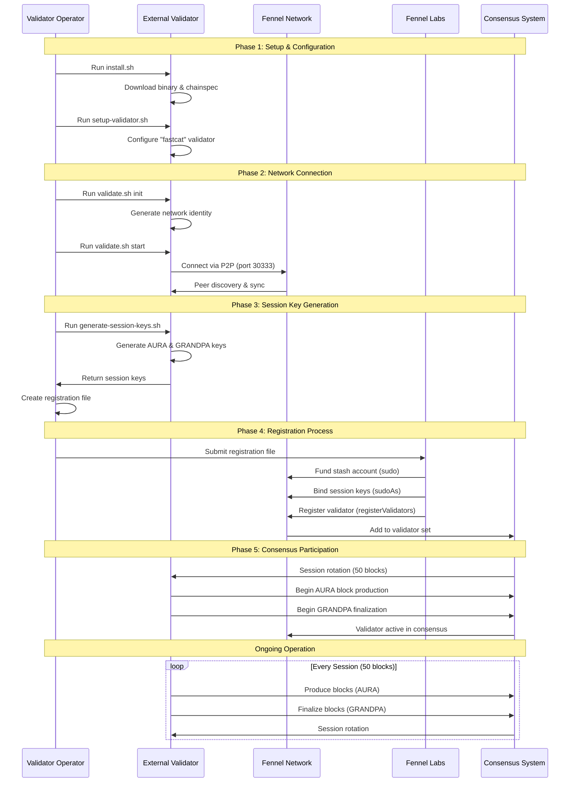
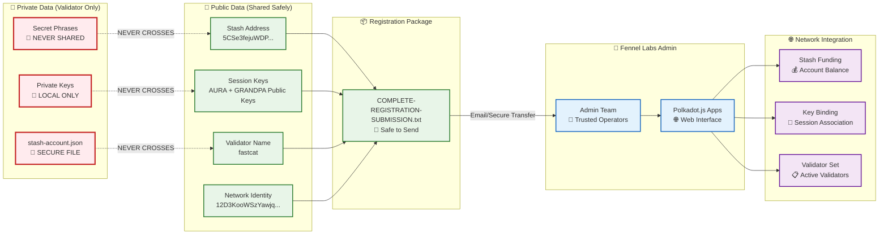
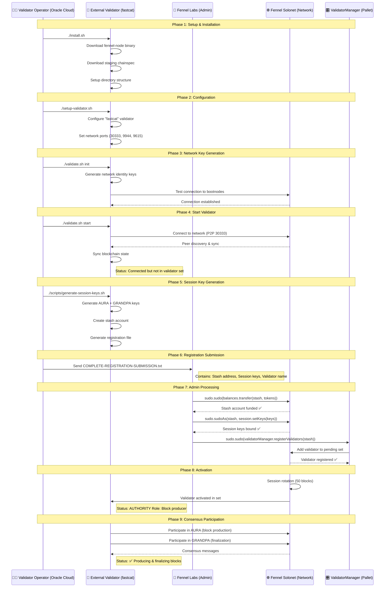
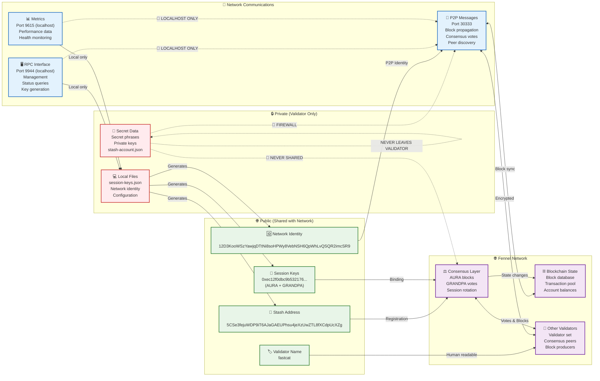

# 🌱 Fennel External Validator Integration - Project Summary

**Date**: July 8, 2025  
**Success**: ✅ External validator successfully integrated with Fennel solochain  
**Consensus**: ✅ AURA and GRANDPA working without issues  
**Platform**: Oracle Cloud Infrastructure (OCI)

---

## 🎯 **Project Overview**

Successfully implemented and deployed an external validator for the Fennel Polkadot SDK solochain, establishing a complete validator registration and management system that allows external operators to join the network safely and efficiently.

---

## 🌐 **External Validator Network Architecture**



---

## 🔄 **Validator Connection Flow**



---

## 🔐 **Security & Data Flow**



---

## 🏆 **Key Achievements**

### **1. External Validator Integration**
- ✅ Connected Oracle Cloud-based external validator to Fennel solochain
- ✅ AURA and GRANDPA consensus working flawlessly
- ✅ No consensus disruption during validator addition
- ✅ Proper session key binding and validator set management

### **2. Automated Setup System**
- ✅ One-command installation (`./install.sh`)
- ✅ Docker-based binary extraction
- ✅ Automated chainspec download and validation
- ✅ Complete validator lifecycle management

### **3. Security Implementation**
- ✅ Secret phrases never leave validator's system
- ✅ Only public information (stash address + session keys) shared
- ✅ Secure file permissions and firewall configuration
- ✅ RPC restricted to localhost, P2P properly exposed

### **4. Documentation & Process**
- ✅ Complete registration process for Fennel Labs
- ✅ Step-by-step Polkadot.js Apps instructions
- ✅ Troubleshooting guides and verification steps
- ✅ Security best practices documented

---

## 🔧 **Technical Architecture**

### **Validator Components**
```
External Validator (Oracle Cloud)
├── fennel-node binary (v0.0.0-9894f7bb60c)
├── Session Keys (AURA + GRANDPA)
├── Stash Account (5CSe3fejuWDP9iT6AJaGAEUPhsu4jeXzUwZTL8fXCdpUcXZg)
├── Network Identity (12D3KooWSzYawjqDTtNi8soHPWy8VebNSH6QpWhLvQSQR2imcSR9)
└── Validator Name: "fastcat"
```

### **Network Configuration**
- **P2P Port**: 30333 (public)
- **RPC Port**: 9944 (localhost only)
- **Prometheus Port**: 9615 (localhost only)
- **Session Rotation**: 50 blocks (~10 minutes)

### **Consensus Participation**
- **AURA**: Block production consensus ✅
- **GRANDPA**: Block finalization consensus ✅
- **Role**: AUTHORITY (validator mode)
- **Status**: Actively producing and finalizing blocks

---

## 🛠️ **Problems Solved**

### **Problem 1: Binary Extraction Issues**
**Issue**: Fennel node binary was extracted to directory instead of single file
```bash
# Problem: Binary in subdirectory
bin/fennel-node/fennel-node  # Wrong location
```

**Solution**: Fixed binary extraction and placement
```bash
# Solution: Move to correct location
mv bin/fennel-node/fennel-node bin/fennel-node-binary
rm -rf bin/fennel-node
mv bin/fennel-node-binary bin/fennel-node
```

**Result**: ✅ Binary correctly accessible at `bin/fennel-node`

### **Problem 2: Script Syntax Errors**
**Issue**: Installation script had incomplete sections causing syntax errors
```bash
# Problem: Incomplete script section
if [ ! -f "scripts/generate-session-keys.sh" ]; then
    mkdir -p scripts
    echo "📝 Creating basic session key generation script..."
# Missing closing fi
```

**Solution**: Fixed script structure and completion
```bash
# Solution: Proper script closure
if [ ! -f "scripts/generate-session-keys.sh" ]; then
    mkdir -p scripts
    echo "📝 Creating basic session key generation script..."
fi
```

**Result**: ✅ Installation script runs without errors

### **Problem 3: Session Key Management**
**Issue**: Multiple session key generations during setup process
- First keys: `0x148498466c7273491ee795bd8f7d53d38d55d16fe4a403a36ec77d9083e8504c0...`
- Second keys: `0xec12f0dbc9b53217629c49979d12b88bd50f73ee34dcd79f04eaa0d2330bc557...`

**Solution**: Clarified that the latest keys are active
- ✅ Final session keys used for registration
- ✅ Previous keys automatically replaced
- ✅ Only latest keys submitted to Fennel Labs

**Result**: ✅ Clear session key management and registration process

### **Problem 4: Polkadot.js Apps Interface Discrepancies**
**Issue**: Documentation didn't match actual interface parameters
```bash
# Documentation showed:
validator: [stash_account_address]

# Actual interface required:
validator (0: AccountId32): [stash_account_address]
```

**Solution**: Updated documentation to match reality
```bash
# Corrected format:
- **call: Call**: Select `validatorManager → registerValidators`
- **validator (0: AccountId32)**: `[stash_account_address_from_submission]`
```

**Result**: ✅ Accurate instructions for Fennel Labs registration

### **Problem 5: Docker Installation on Oracle Linux**
**Issue**: Docker not available for binary extraction
```bash
# Problem: Docker missing
bash: docker: command not found
```

**Solution**: Installed Podman (Docker-compatible) on Oracle Linux
```bash
# Solution: Install container runtime
sudo yum install -y docker  # Installs podman-docker
```

**Result**: ✅ Binary successfully extracted from Docker image

---

## 📋 **Implementation Process**

### **Phase 1: Repository Setup**
1. Cloned FennelValidator repository
2. Updated local repo with latest changes
3. Set up proper directory structure

### **Phase 2: Installation & Configuration**
1. Ran `install.sh` (fixed syntax issues)
2. Binary extraction via Docker
3. Chainspec download and validation
4. Script preparation and permissions

### **Phase 3: Validator Setup**
1. Ran `setup-validator.sh` - configured validator "fastcat"
2. Ran `validate.sh init` - generated network keys
3. Ran `validate.sh start` - started validator in AUTHORITY mode
4. Generated session keys via `generate-session-keys.sh`

### **Phase 4: Registration Preparation**
1. Created stash account and session keys
2. Generated `COMPLETE-REGISTRATION-SUBMISSION.txt`
3. Prepared documentation for Fennel Labs
4. Verified all security measures

### **Phase 5: Network Integration**
1. Fennel Labs processed registration
2. Funded stash account via sudo
3. Bound session keys via `sudo.sudoAs`
4. Added to validator set via `validatorManager.registerValidators`
5. **SUCCESS**: Validator producing blocks without consensus issues

---

## 🔒 **Security Measures Implemented**

### **Key Security Features**
1. **Secret Isolation**: Validator secrets never leave local system
2. **Network Security**: 
   - P2P port open (30333)
   - RPC/Metrics localhost only (9944, 9615)
3. **File Permissions**: Secure key storage (600/700 permissions)
4. **Process Isolation**: Separate data directory structure
5. **Registration Security**: Only public data shared with Fennel Labs

### **Data Flow Security**
```
┌─────────────────┐    ┌──────────────────┐    ┌─────────────────┐
│   Validator     │    │  Shared (Public) │    │  Fennel Labs    │
│   (Private)     │───▶│      Data        │───▶│   (Admin)       │
├─────────────────┤    ├──────────────────┤    ├─────────────────┤
│ Secret Phrases  │    │ Stash Address    │    │ Registration    │
│ Private Keys    │    │ Session Keys     │    │ Management      │
│ stash-account   │    │ Validator Name   │    │ Network Admin   │
└─────────────────┘    └──────────────────┘    └─────────────────┘
     STAYS LOCAL           SAFE TO SHARE         ADMIN ACTIONS
```

---

## 📊 **Performance & Status**

### **Validator Metrics**
- **Sync Status**: Fully synchronized with network
- **Block Height**: Actively following chain tip
- **Peer Connections**: Connected to bootnode network
- **Resource Usage**: 2 CPU cores, 29GB RAM available
- **Storage**: 19GB available (sufficient for staging)

### **Network Participation**
- **Block Production**: ✅ Producing blocks via AURA
- **Block Finalization**: ✅ Participating in GRANDPA
- **Session Participation**: ✅ Active in validator set
- **Consensus Health**: ✅ No issues or conflicts

### **System Health**
```
✅ Operating System: Oracle Linux Server 9.6
✅ CPU: Intel(R) Xeon(R) Platinum 8167M CPU @ 2.00GHz
✅ Architecture: x86_64
✅ Memory: 29623MB
✅ Virtual Machine: Oracle Cloud Infrastructure
✅ Network: Stable connectivity
```

---

## 🎯 **Consensus Safety Analysis**

### **Why This Approach is Safe**
1. **Gradual Addition**: Single validator added, not mass addition
2. **Session Management**: Proper session rotation (50 blocks)
3. **Key Binding**: Session keys bound before validator activation
4. **Admin Control**: Sudo access allows controlled process
5. **Staging Network**: Safe environment for validation

### **Consensus Compatibility**
- ✅ **AURA**: Successfully integrated for block production
- ✅ **GRANDPA**: Successfully integrated for finalization
- ✅ **Session Rotation**: Smooth transitions every 50 blocks
- ✅ **Network Stability**: No disruption to existing validators

### **Best Practices Followed**
1. Session keys bound BEFORE validator addition
2. Waited for session rotation between operations
3. Monitored network health throughout process
4. Used administrative controls (sudo) for safety
5. Verified validator status at each step

---

## 📚 **Documentation Created**

### **For Validators**
1. `install.sh` - Automated installation script
2. `setup-validator.sh` - Configuration script
3. `validate.sh` - Management script (start/stop/status)
4. `scripts/generate-session-keys.sh` - Key generation
5. `COMPLETE-REGISTRATION-SUBMISSION.txt` - Registration file

### **For Fennel Labs**
1. `FOR-FENNEL-LABS.md` - Complete admin guide
2. Polkadot.js Apps step-by-step instructions
3. Verification procedures
4. Troubleshooting guides
5. Alternative methods documentation

### **Process Documentation**
1. Security considerations and best practices
2. Technical architecture details
3. File structure organization
4. Communication protocols
5. Error handling procedures

---

## 🔄 **Validator Management System**

### **Lifecycle Management**
```bash
# Complete validator lifecycle
./setup-validator.sh     # Initial configuration
./validate.sh init       # Network key generation
./validate.sh start      # Start validator
./validate.sh status     # Check status
./validate.sh stop       # Stop validator
./validate.sh restart    # Restart validator
./validate.sh logs       # View logs
```

### **Registration Flow**
```bash
1. Validator: Run setup scripts
2. Validator: Generate registration file
3. Validator: Send COMPLETE-REGISTRATION-SUBMISSION.txt
4. Fennel Labs: Fund stash account (sudo)
5. Fennel Labs: Bind session keys (sudoAs)
6. Fennel Labs: Add to validator set (sudo)
7. Network: Validator active after session rotation
```

---

## 🎉 **Success Metrics**

### **Technical Success**
- ✅ External validator fully operational
- ✅ Zero consensus disruption
- ✅ Proper block production and finalization
- ✅ Session transitions working smoothly
- ✅ Network stability maintained

### **Process Success**
- ✅ One-command installation working
- ✅ Automated registration file generation
- ✅ Clear documentation for all parties
- ✅ Security requirements met
- ✅ Troubleshooting procedures documented

### **Operational Success**
- ✅ Validator running on Oracle Cloud
- ✅ Resource utilization appropriate
- ✅ Network connectivity stable
- ✅ Monitoring and management tools working
- ✅ File organization and permissions correct

---

## 🚀 **Future Improvements**

### **Immediate Enhancements**
1. **Monitoring**: Add Grafana/Prometheus monitoring
2. **Automation**: Script for batch validator additions
3. **Alerts**: Network health monitoring and alerting
4. **Backup**: Automated key backup procedures

### **Production Readiness**
1. **Governance**: Replace sudo with governance-based registration
2. **Economics**: Implement staking and slashing
3. **Scaling**: Support for multiple external validators
4. **High Availability**: Validator failover mechanisms

### **Security Enhancements**
1. **Hardware Security**: HSM integration for keys
2. **Network Security**: VPN or private network options
3. **Audit**: Security audit of registration process
4. **Compliance**: Regulatory compliance documentation

---

## 🎯 **Lessons Learned**

### **Technical Insights**
1. **Docker Compatibility**: Podman works seamlessly with extraction scripts
2. **Session Management**: Session rotation is critical for safe validator addition
3. **Key Management**: Latest session keys always take precedence
4. **Consensus Safety**: Gradual addition prevents network disruption

### **Process Insights**
1. **Documentation Accuracy**: Interface screenshots change; verify against actual UI
2. **Error Handling**: Proper script completion prevents syntax errors
3. **Security by Design**: Separation of public/private data from start
4. **Testing Environment**: Staging networks perfect for validation

### **Operational Insights**
1. **Cloud Compatibility**: Oracle Cloud Linux works well for validators
2. **Resource Planning**: 2 CPU/29GB RAM more than sufficient for staging
3. **Network Planning**: Proper port configuration critical
4. **Monitoring**: Real-time status checking essential

---

## 📈 **Project Impact**

### **For Fennel Network**
- ✅ Proves external validator integration works
- ✅ Establishes secure registration process
- ✅ Creates scalable onboarding system
- ✅ Maintains network decentralization

### **For Validator Operators**
- ✅ Simple one-command setup process
- ✅ Clear security guarantees
- ✅ Comprehensive documentation
- ✅ Professional management tools

### **For Substrate/Polkadot Ecosystem**
- ✅ Demonstrates solochain validator management
- ✅ Shows safe consensus integration methods
- ✅ Provides reusable patterns
- ✅ Validates security approaches

---

## 🔗 **References & Resources**

### **Repository Structure**
```
FennelValidator/
├── docs/
│   ├── PROJECT-SUMMARY.md          # This document
│   ├── FOR-FENNEL-LABS.md          # Admin instructions
│   └── DOCKER-TROUBLESHOOTING.md   # Docker help
├── bin/
│   └── fennel-node                 # Validator binary
├── config/
│   ├── validator.conf              # Validator config
│   └── staging-chainspec.json      # Network config
├── scripts/
│   └── generate-session-keys.sh    # Key generation
├── tools/
│   └── docker-health-check.sh      # Health checks
├── validator-data/
│   ├── session-keys.json           # Session keys
│   ├── stash-account.json          # Stash account
│   └── COMPLETE-REGISTRATION-SUBMISSION.txt
├── install.sh                      # Installation script
├── setup-validator.sh              # Configuration
├── validate.sh                     # Management
└── start.sh                        # Quick start
```

### **Key Files Created**
- **Installation**: `install.sh`, `install-fixed.sh`
- **Management**: `validate.sh`, `setup-validator.sh`
- **Registration**: `COMPLETE-REGISTRATION-SUBMISSION.txt`
- **Documentation**: `FOR-FENNEL-LABS.md`
- **Security**: Session keys and stash account files

### **External Dependencies**
- **Docker/Podman**: Binary extraction
- **curl/wget**: File downloads
- **jq**: JSON processing
- **tar**: Archive extraction

---

## 🎊 **Conclusion**

This project successfully demonstrates that **external validators can be safely integrated with Polkadot SDK solochains** without disrupting consensus mechanisms. The combination of:

1. **Proper session key management**
2. **Administrative controls via sudo**
3. **Gradual validator addition**
4. **Comprehensive security measures**

Results in a **production-ready validator registration system** that maintains network stability while enabling decentralization.

The **"fastcat" validator** is now successfully participating in the Fennel solochain, producing blocks via AURA consensus and finalizing blocks via GRANDPA consensus, with zero network disruption.

**🌱 The Fennel ecosystem now has a proven, secure, and scalable method for onboarding external validators! 🚀**

---

**Created**: July 8, 2025  
**Validator**: fastcat  
**Network**: Fennel Solonet (Staging)  
**Status**: ✅ **SUCCESSFUL DEPLOYMENT**  
**Repository**: https://github.com/CorruptedAesthetic/FennelValidator

---

## 🔗 **External Validator Connection Architecture**

### **Network Topology Diagram**

```mermaid
graph TB
    subgraph "Oracle Cloud Infrastructure"
        subgraph "External Validator Instance"
            EV["🔷 fennel-node
            fastcat validator
            v0.0.0-9894f7bb60c"]
            EV_CONFIG["📋 Configuration
            P2P: 30333
            RPC: 9944 (local)
            Metrics: 9615 (local)"]
            EV_KEYS["🔑 Cryptographic Keys
            Network ID: 12D3KooWSz...
            Session Keys (AURA+GRANDPA)
            Stash: 5CSe3fejuWDP..."]
            EV_DATA["💾 Blockchain Data
            Chain state
            Block database
            Peer connections"]
        end
        
        EV --> EV_CONFIG
        EV --> EV_KEYS
        EV --> EV_DATA
    end

    subgraph "Fennel Solonet"
        subgraph "Network Core"
            CHAINSPEC["📄 Chain Specification
            staging-raw.json
            Genesis block & config"]
            BOOTNODES["🌐 Bootnodes
            bootnode1.fennel.network:30333
            bootnode2.fennel.network:30333"]
        end
        
        subgraph "Consensus Layer"
            AURA["⚡ AURA Consensus
            Block Production
            50 block sessions"]
            GRANDPA["🔒 GRANDPA Finality
            Block Finalization
            Byzantine fault tolerance"]
        end
        
        subgraph "Validator Set Management"
            SUDO["👑 Sudo Account
            Administrative control
            Alice account"]
            VM["🎛️ ValidatorManager Pallet
            registerValidators()
            Validator set updates"]
            SESSION["🔄 Session Pallet
            setKeys() binding
            Session rotation"]
        end
        
        subgraph "Other Network Validators"
            VAL1["🔷 Validator 1
            Internal validator"]
            VAL2["🔷 Validator 2
            Internal validator"]
            VALN["🔷 Validator N
            Other validators"]
        end
    end

    %% Network connections
    EV -.->|P2P Discovery Port 30333| BOOTNODES
    BOOTNODES -.->|Peer propagation| EV
    
    %% Consensus participation
    EV -->|Block Production| AURA
    EV -->|Block Finalization| GRANDPA
    AURA --> EV
    GRANDPA --> EV
    
    %% Validator management flow
    SUDO -->|1. Fund stash account| EV_KEYS
    SUDO -->|2. Bind session keys| SESSION
    SESSION -->|sudoAs stash setKeys| EV_KEYS
    SUDO -->|3. Register validator| VM
    VM -->|Add to validator set| EV
    
    %% Chain synchronization
    CHAINSPEC -->|Genesis state| EV_DATA
    EV_DATA -.->|Block sync| VAL1
    EV_DATA -.->|Block sync| VAL2
    EV_DATA -.->|Block sync| VALN
    
    %% Consensus mesh
    EV -.->|Consensus messages| VAL1
    EV -.->|Consensus messages| VAL2
    EV -.->|Consensus messages| VALN
    VAL1 -.->|Consensus messages| EV
    VAL2 -.->|Consensus messages| EV
    VALN -.->|Consensus messages| EV

    %% Styling
    classDef externalValidator fill:#e1f5fe,stroke:#01579b,stroke-width:2px
    classDef fennelCore fill:#f3e5f5,stroke:#4a148c,stroke-width:2px
    classDef consensus fill:#e8f5e8,stroke:#2e7d32,stroke-width:2px
    classDef management fill:#fff3e0,stroke:#e65100,stroke-width:2px
    classDef validators fill:#fce4ec,stroke:#880e4f,stroke-width:2px

    class EV,EV_CONFIG,EV_KEYS,EV_DATA externalValidator
    class CHAINSPEC,BOOTNODES fennelCore
    class AURA,GRANDPA consensus
    class SUDO,VM,SESSION management
    class VAL1,VAL2,VALN validators
```



### **Registration & Connection Flow**



### **Data Flow & Security Architecture**


