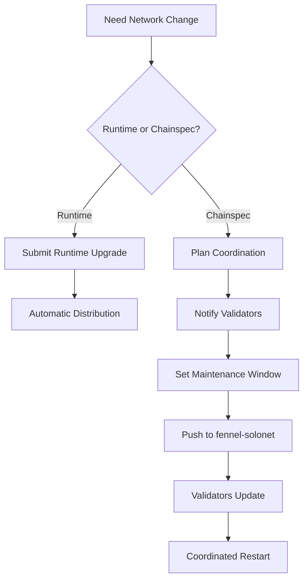
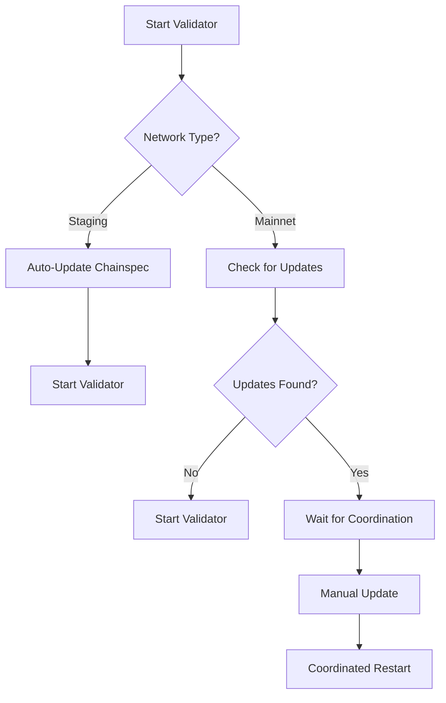

# Chainspec Management for Fennel Network

**Understanding chainspec updates in a Polkadot SDK solochain environment**

## 🏗️ **Network Architecture Context**

Fennel operates as a **Polkadot SDK solochain** with the following characteristics:
- **Sovereign network**: Independent consensus and security
- **SUDO governance**: Organization controls network governance initially  
- **External validators**: Applied and approved validators secure the network
- **Coordinated updates**: Changes require network-wide coordination

## 📋 **Chainspec vs Runtime Updates**

### **What Chainspecs Control**
```json
{
  "name": "Fennel Staging",
  "id": "fennel_staging",
  "bootNodes": ["/ip4/..."],           // ← Network topology
  "genesis": {                         // ← Initial state
    "runtime": {...},                  // ← Initial runtime code
    "balances": {...},                 // ← Initial balances
    "session": {"keys": [...]}         // ← Initial validator set
  }
}
```

### **What Runtime Upgrades Control**
- **Business logic** (pallet functionality)
- **Consensus parameters** (block time, staking rules)
- **Governance rules** (proposal thresholds, voting periods)
- **Network economics** (fees, rewards)

## ⚡ **Update Mechanisms Comparison**

| Update Type | Trigger | Distribution | Restart Required | Coordination |
|-------------|---------|--------------|------------------|--------------|
| **Runtime Upgrade** | Sudo/Governance | Automatic (on-chain) | No | Automatic |
| **Chainspec Update** | Manual deployment | Manual download | Usually Yes | Required |

## 🔄 **Smart Chainspec Update Strategy**

### **Staging Network (Auto-Update)**
```bash
# Safe for staging - validators auto-update
./validate.sh start
# ✅ Auto-downloads latest staging chainspec
# ✅ Safe for testing and development
```

**Why auto-update works for staging:**
- Non-production environment
- Frequent changes expected
- Validator downtime acceptable
- Learning environment benefits from latest config

### **Mainnet Network (Manual Coordination)**
```bash
# Production safety - requires coordination
./validate.sh start
# 🔍 Detects chainspec changes
# ⚠️  Warns about updates but doesn't auto-apply
# 🛡️  Requires manual confirmation

# Force update (coordinated scenario)
./validate.sh update-chainspec --force
```

**Why manual coordination is required:**
- Production validators need uptime
- Network consensus could break
- Changes may require simultaneous restarts
- Economic implications of downtime

## 🚨 **Critical Scenarios & Handling**

### **Scenario 1: Bootnode Changes**
```json
// Old chainspec
"bootNodes": ["/ip4/old-bootnode:30333/p2p/..."]

// New chainspec  
"bootNodes": ["/ip4/new-bootnode:30333/p2p/..."]
```

**Risk**: Network fragmentation if validators update at different times
**Solution**: Coordinate restart window with all validators

### **Scenario 2: Genesis State Changes**
```json
// Changes to initial validator set or balances
"genesis": {
  "session": {"keys": [...]}  // ← Modified initial validators
}
```

**Risk**: Complete network incompatibility
**Solution**: This typically requires new network launch, not update

### **Scenario 3: Network Identity Changes**
```json
"id": "fennel_staging"  // → "fennel_mainnet"
"name": "Fennel Staging"  // → "Fennel Production"
```

**Risk**: Validators connecting to wrong network
**Solution**: Treat as new network deployment

## 📅 **Best Practices for Network Operators**

### **For the SUDO Organization**

#### **Runtime Updates (Preferred)**
```bash
# Most changes should be runtime upgrades
sudo.sudoUncheckedWeight(
  system.setCode(new_runtime_wasm),
  weight
)
```

**Benefits:**
- Automatic distribution to all nodes
- No validator coordination required
- No restarts needed
- Atomic network-wide updates

#### **Chainspec Updates (When Necessary)**
```bash
# 1. Plan update with advance notice
# 2. Coordinate with validators
# 3. Set maintenance window
# 4. Push chainspec to fennel-solonet repo
# 5. Confirm all validators have updated
```

### **For External Validators**

#### **Staging Environment**
- ✅ Allow auto-updates (implemented)
- ✅ Test all scenarios regularly
- ✅ Practice coordination procedures

#### **Production Environment**  
- 🛡️ Monitor for chainspec updates
- 📞 Coordinate with network operators
- ⏰ Plan maintenance windows
- 🔍 Verify updates before applying

## 🔧 **Implementation Details**

### **Auto-Detection Logic**
```bash
# The validator automatically:
1. Downloads latest chainspec
2. Compares SHA256 hashes
3. For staging: Auto-applies
4. For mainnet: Warns and waits for manual confirmation
```

### **Safety Mechanisms**
- **Hash verification**: Ensures file integrity
- **JSON validation**: Prevents corrupted chainspecs
- **Rollback capability**: Keeps previous version
- **Manual override**: Force update when coordinated

### **Network Monitoring**
```bash
# Check for pending chainspec updates
./validate.sh update-chainspec

# Monitor current chainspec
sha256sum config/staging-chainspec.json
```

## 📊 **Recommended Update Workflow**

### **For Network Operators (SUDO)**



### **For External Validators**



## 🎯 **Conclusion & Recommendations**

### **Current Implementation is Correct Because:**

1. **Staging Safety**: Auto-updates are safe for testing environment
2. **Production Safety**: Manual coordination prevents network issues
3. **Runtime Priority**: Most updates should be runtime upgrades anyway
4. **Operator Control**: Network operators maintain coordination capability

### **Key Principles:**

- **Staging**: Fast iteration, auto-updates, learning-focused
- **Production**: Stability, coordination, manual control
- **Runtime First**: Prefer runtime upgrades over chainspec changes
- **Communication**: Always coordinate production changes

### **For Your Organization:**

✅ **Use runtime upgrades** for most network changes
✅ **Reserve chainspec updates** for topology/infrastructure changes  
✅ **Coordinate all production changes** with validators
✅ **Test everything in staging first**

This approach balances **innovation velocity** (staging) with **production stability** (mainnet) while maintaining proper control over your solochain network. 